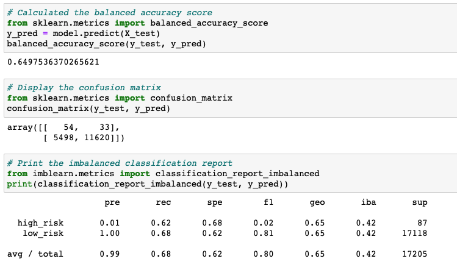
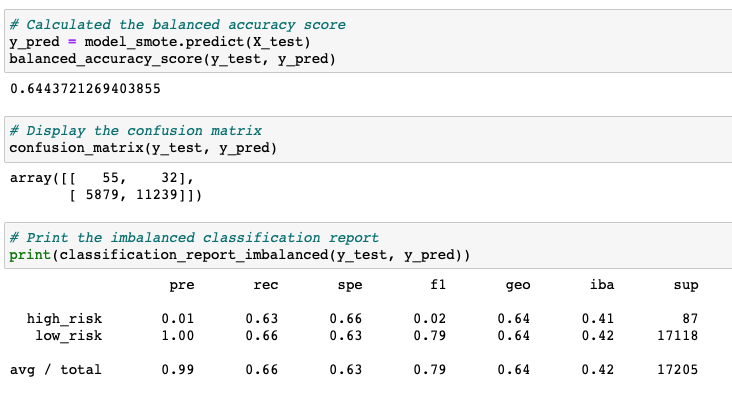
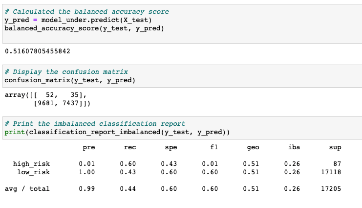
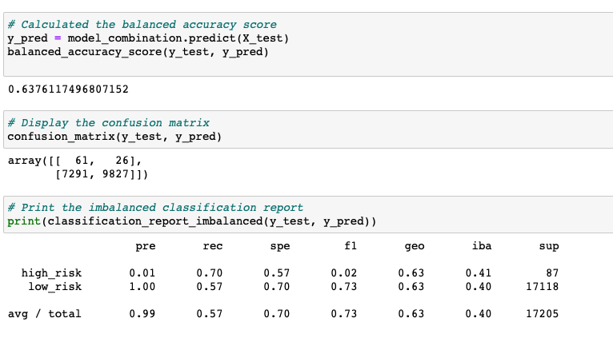
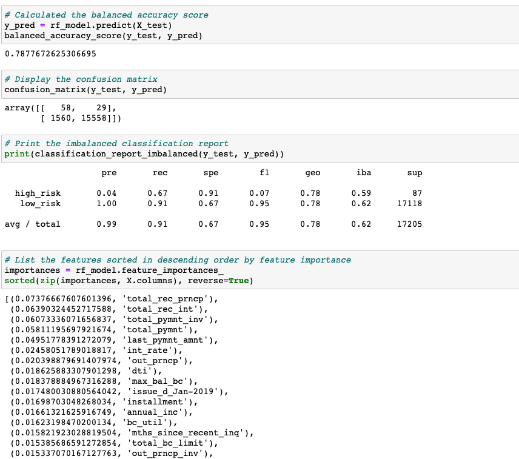
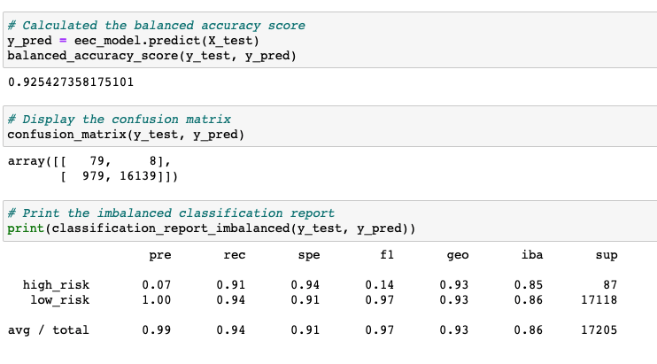

# Credit_Risk_Analysis

## Overview

Credit risk is an inherently unbalanced classification problem, as good loans easily outnumber risky loans. Therefore, we’ll need to employ different techniques to train and evaluate models with unbalanced classes. 

For this project we will use imbalanced-learn and scikit-learn libraries to build and evaluate models using resampling.

Using the credit card credit dataset from LendingClub, a peer-to-peer lending services company, we’ll oversample the data using the RandomOverSampler and SMOTE algorithms, and undersample the data using the ClusterCentroids algorithm. Then, we’ll use a combinatorial approach of over- and undersampling using the SMOTEENN algorithm. Next, we’ll compare two new machine learning models that reduce bias, BalancedRandomForestClassifier and EasyEnsembleClassifier, to predict credit risk. 

## Results

From the credit card dataset we will apply different algorithm to resample the dataset, view the count of the target classes, train a logistic regression or an ensemble classifier, calculate the balanced accuracy score, generate a confusion matrix, and generate a classification report.

### Naive Random Oversampling (RandomOverSampler)

- Balanced Accuracy Score: 0.65 
- Precision High Risk: 0.01
- Precision Low Risk: 1.00 
- Recall High Risk: 0.62 
- Recall Low Risk: 0.68 

### SMOTE Oversampling 

- Balanced Accuracy Score: 0.64
- Precision High Risk: 0.01
- Precision Low Risk: 1.00
- Recall High Risk: 0.63
- Recall Low Risk: 0.66

### Undersampling (ClusterCentroids)

- Balanced Accuracy Score: 0.52
- Precision High Risk: 0.01
- Precision Low Risk: 1.00
- Recall High Risk: 0.60
- Recall Low Risk: 0.43

### Combination (Over and Under) Sampling (SMOTEENN)

- Balanced Accuracy Score: 0.64
- Precision High Risk: 0.01
- Precision Low Risk: 1.00
- Recall High Risk: 0.70
- Recall Low Risk: 0.57

### Ensemble Learners 1 - Balanced Random Forest Classifier

- Balanced Accuracy Score: 0.79
- Precision High Risk: 0.04
- Precision Low Risk: 1.00
- Recall High Risk: 0.67
- Recall Low Risk: 0.91

### Ensemble Learners 2 - Easy Ensemble AdaBoost Classifier

- Balanced Accuracy Score: 0.93
- Precision High Risk: 0.07
- Precision Low Risk: 1.00
- Recall High Risk: 0.91
- Recall Low Risk: 0.94

## Summary

All six models show a very high precision score at 1.00 for predicting low risk loans. However this could be merely due to the high number of low risk population. In contrast, all six models show a very low precision score (all less than 0.10) when predicting high risk loans. In terms for balanced accuracy score, both the Ensemble models show a higher score than the other resampling models, with the Easy Ensemble AdaBoost Classifier showing highest balanced accuracy score at 0.93. Moreover, the Easy Ensemble AdaBoost Classifier shows the highest recall scores (0.91 and 0.94 for high risk and low risk). In other words, the Easy Ensemble AdaBoost model has much lesser false negative results for both high risk and low risk than other resampling models.  

Descpite the higher recall and accuracy scores from the Easy Ensemble AdaBoost Classifier model, I still would not recommend it, and neither for the other five machine learning models at this stage. The precision score for all six models at predicting high risk are too low, meaning there are way too many false positives identified. If the bank falsely identify low risk customers as high risk, it would incur unnecessary business loss and expenses and would hurt its reputation. 
